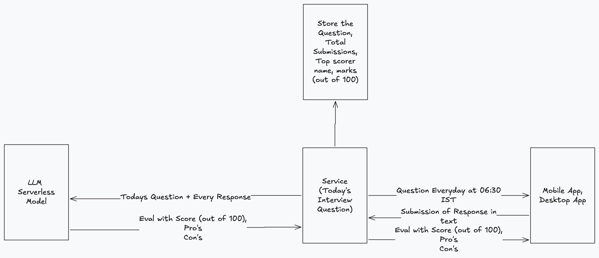
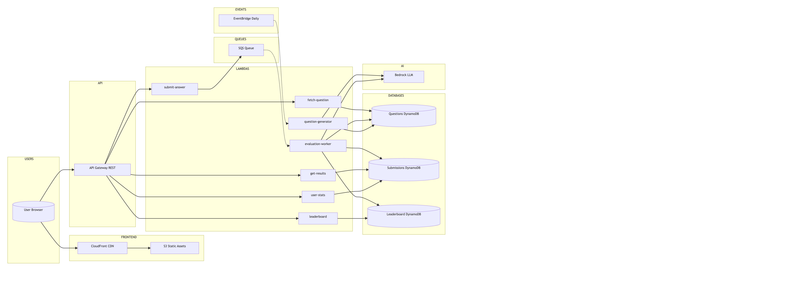

# Arch2Lead Interviewer

A daily system-design interview challenge platform. A new architecture question every day — submit written answers and get AI-powered evaluations via Amazon Bedrock (Claude).

## Diagrams- Functional, Architecture

### Functional Requirement Diagram



### High Level Architecture Diagram



## Project Structure

```
backend/         — Go backend (7 Lambda functions + local dev server)
frontend/        — React SPA (Vite, react-router-dom, Chart.js)
terraform/       — AWS IaC (API Gateway, DynamoDB, SQS, Lambda, Bedrock, S3, CloudFront)
```

## Local Development

### Backend

```bash
cd backend
make docker-up
# Starts DynamoDB Local (8000), app server (8080), DynamoDB Admin UI (8001)
```

Or without Docker:

```bash
cd backend
make server
```

### Frontend

```bash
cd frontend
npm install
npm run dev
# Vite dev server on :5173, proxies API to localhost:8080
```

## API Endpoints

| Method | Path                           | Description                      |
| ------ | ------------------------------ | -------------------------------- |
| GET    | `/question?date=YYYY-MM-DD`    | Get question (defaults to today) |
| POST   | `/answer`                      | Submit answer                    |
| GET    | `/results/{submissionId}`      | Get evaluation                   |
| GET    | `/leaderboard?date=YYYY-MM-DD` | Leaderboard                      |
| GET    | `/stats/{userId}`              | User stats                       |

## Production Deployment

```bash
cd terraform
terraform init
terraform apply
```

Build and deploy the frontend:

```bash
cd frontend
npm run build
aws s3 sync dist/ s3://ai-interviewer-frontend-cef0ac55
```

## Tech Stack

- **Backend:** Go, AWS Lambda, DynamoDB, SQS, Bedrock (Claude)
- **Frontend:** React 18, Vite, Chart.js, react-markdown
- **Infrastructure:** Terraform, API Gateway, CloudFront, EventBridge

### Links

- Frontend: [Frontend](https://d2b75ixlw272nl.cloudfront.net/)
